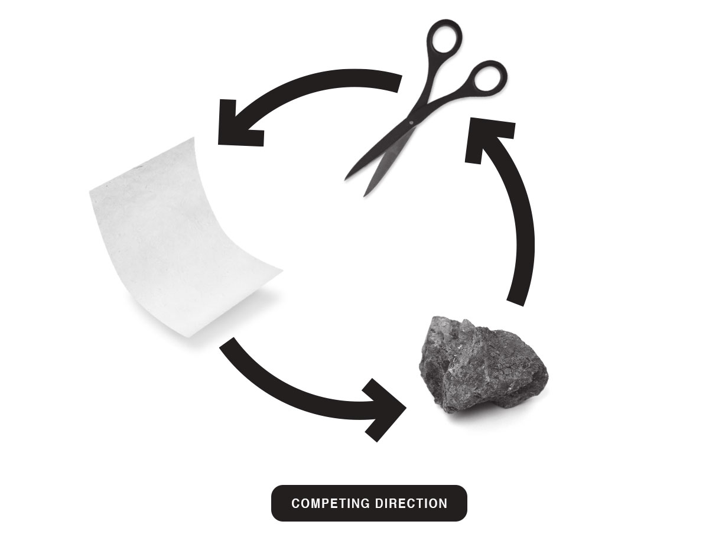

## Rock Paper Scissors - Python text-based take on a classic!

Pick your weapon and play against the computer - you'll only get a virtual sting if you lose!

### Prerequisites

All you need is <a href="https://www.python.org/">Python 3</a>  to play.

### Usage
Clone the project, <code>cd</code> to your directory/download, and run the game.py file in a <em>Python 3</em> shell (Terminal on a mac / Linux, Windows command prompt).

### Rules
Same as the classic game:

+ Paper covers Rock  
+ Scissors cuts Paper  
+ Rock smashes Scissors

**Choose your weapon wisely!**

Built with <a href="https://www.python.org/doc/">Python 3</a>

Enjoy!

### License 
MIT

## Sahar MahmoudiMotlagh
  
  

## Rock Paper Scissors Game with Python!

**Rock paper scissors** (also known by other orderings of the three items, with "rock" sometimes being called "stone", or as Rochambeau, roshambo, or ro-sham-bo) is a **hand game**, usually played between two people, in which each player simultaneously forms one of three shapes with an outstretched hand.
  
 These shapes are **"rock" (a closed fist), "paper" (a flat hand), and "scissors"** (a fist with the index finger and middle finger extended, forming a V). "Scissors" is identical to the two-fingered V sign (also indicating "victory" or "peace") except that it is pointed horizontally instead of being held upright in the air.

## Installation

TODO: 
+ Insert the installation disc into the proper drive on your computer.
+ Generally, discs will automatically run. ...
+ If the disc does not run automatically, navigate to the disc itself using the File Explorer or Finder, then open your disc drive. ...
+ Follow the onscreen setup instructions.

## Contributing

1. Fork it!
2. Create your feature branch: `git checkout -b my-new-feature`
3. Commit your changes: `git commit -am 'Add some feature'`
4. Push to the branch: `git push origin my-new-feature`
5. Submit a pull request :D

## Credits

TODO:
https://en.wikipedia.org/wiki/Rock_paper_scissors
https://www.lifewire.com/how-to-install-games-on-your-computer-4691261

## License

MIT
